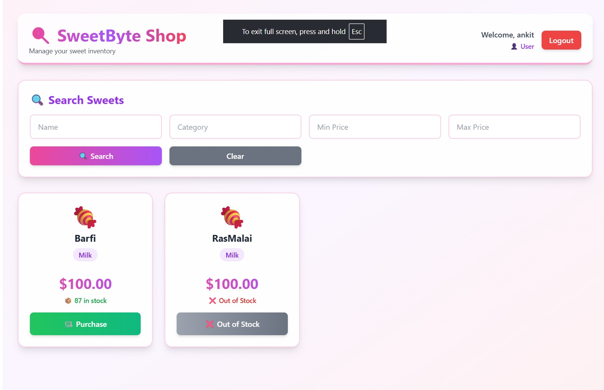
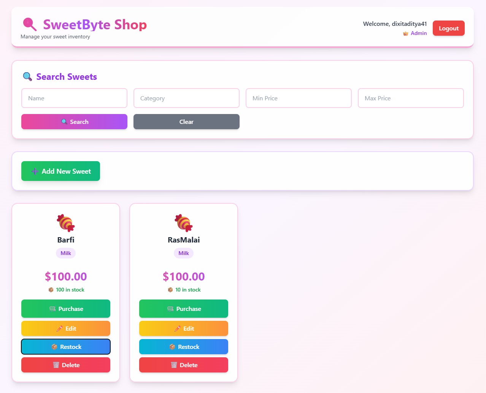
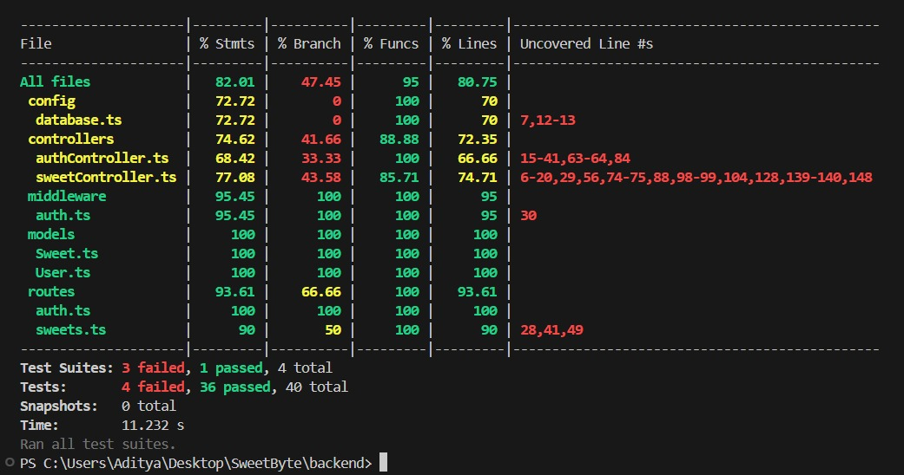

# Sweet Shop Management System

A full-stack web application for managing a sweet shop inventory with user authentication, product management, and purchase functionality.

## Features

- **User Authentication**: Register and login with JWT token-based authentication
- **Sweet Management**: View, search, and filter sweets by name, category, and price
- **Purchase System**: Users can purchase sweets (decreases inventory)
- **Admin Features**: Add, update, delete, and restock sweets (admin only)
- **Responsive Design**: Modern, clean UI that works on all devices

## Tech Stack

### Backend
- Node.js with Express
- TypeScript
- MongoDB with Mongoose
- JWT for authentication
- Jest for testing

### Frontend
- React 18
- TypeScript
- Vite
- React Router
- Axios for API calls

## Project Structure

```
SweetByte/
├── backend/
│   ├── src/
│   │   ├── __tests__/          # Test files
│   │   ├── config/             # Database configuration
│   │   ├── controllers/        # Route controllers
│   │   ├── middleware/         # Auth middleware
│   │   ├── models/             # MongoDB models
│   │   ├── routes/             # API routes
│   │   └── server.ts           # Express server
│   ├── package.json
│   └── tsconfig.json
├── frontend/
│   ├── src/
│   │   ├── components/         # React components
│   │   ├── context/            # Context providers
│   │   ├── pages/              # Page components
│   │   ├── App.tsx
│   │   └── main.tsx
│   ├── package.json
│   └── vite.config.ts
└── README.md
```

## Setup Instructions

### Prerequisites
- Node.js (v18 or higher)
- MongoDB (local or cloud instance)
- npm or yarn

### Backend Setup

1. Navigate to the backend directory:
```bash
cd backend
```

2. Install dependencies:
```bash
npm install
```

3. Create a `.env` file in the backend directory:
```env
PORT=5000
MONGODB_URI=your_mongodb_connection_string_here
JWT_SECRET=your_jwt_secret_key_here
NODE_ENV=development
```

4. Replace `your_mongodb_connection_string_here` with your MongoDB connection string.
5. Replace `your_jwt_secret_key_here` with a secure random string for JWT signing.

6. Run the development server:
```bash
npm run dev
```

The backend server will run on `http://localhost:5000`

### Frontend Setup

1. Navigate to the frontend directory:
```bash
cd frontend
```

2. Install dependencies:
```bash
npm install
```

3. Run the development server:
```bash
npm run dev
```

The frontend will run on `http://localhost:3000`
### User Dashboard


### Admin Dashboard


### Test Coverage


## API Endpoints

### Authentication
- `POST /api/auth/register` - Register a new user
- `POST /api/auth/login` - Login user

### Sweets (Protected)
- `GET /api/sweets` - Get all sweets
- `GET /api/sweets/search` - Search sweets (query params: name, category, minPrice, maxPrice)
- `POST /api/sweets` - Create a new sweet (Admin only)
- `PUT /api/sweets/:id` - Update a sweet (Admin only)
- `DELETE /api/sweets/:id` - Delete a sweet (Admin only)

### Inventory (Protected)
- `POST /api/sweets/:id/purchase` - Purchase a sweet (decreases quantity)
- `POST /api/sweets/:id/restock` - Restock a sweet (Admin only)

## Testing

### Backend Tests

Run tests from the backend directory:
```bash
npm test
```

Run tests with coverage:
```bash
npm test -- --coverage
```


## Usage

1. Start both backend and frontend servers
2. Open `http://localhost:3000` in your browser
3. Register a new account or login
4. Browse sweets, search, and make purchases
5. If you need admin access, you can manually update a user's role in the database to "admin"

## Deployment

### Frontend (Vercel)
The frontend is deployed on Vercel at: https://sweet-byte.vercel.app

### Backend (Render)
The backend is configured to deploy on Render using the `render.yaml` file.

Your Render backend URL : https://sweetbyte-4ior.onrender.com

## My AI Usage

### AI Tools Used
- **Cursor AI Assistant**: Used throughout the development process for code generation, debugging, and implementation guidance.

### How AI Was Used

1. **Project Setup**: AI helped generate the initial project structure, package.json files, and configuration files (tsconfig.json, vite.config.ts, jest.config.js).

2. **Backend Development**:
   - Generated MongoDB models (User, Sweet) with proper schemas and validation
   - Created Express routes and controllers following RESTful principles
   - Implemented JWT authentication middleware
   - Generated comprehensive test suites following TDD approach

3. **Frontend Development**:
   - Created React components and pages structure
   - Implemented authentication context and protected routes
   - Built responsive UI components with modern styling
   - Generated form handling and API integration code

4. **Code Quality**:
   - Used AI to ensure proper error handling and edge case coverage
   - Generated validation logic for forms and API endpoints
   - Helped maintain consistent code style and structure

### Reflection on AI Impact

Using AI significantly accelerated the development process, especially for:
- **Boilerplate Generation**: Quickly setting up project structure and configuration files
- **Test Writing**: Generating comprehensive test cases that cover edge cases I might have missed
- **Code Patterns**: Following best practices and common patterns for Express and React

However, I made sure to:
- Understand all generated code before committing
- Customize and adapt AI suggestions to fit the project requirements
- Maintain code simplicity as requested (student-level, not overly complex)
- Review and test all functionality manually
- Follow TDD principles by writing tests first, then implementing features

The AI acted as a powerful pair-programming partner, helping me build a complete, functional application while ensuring code quality and best practices.
